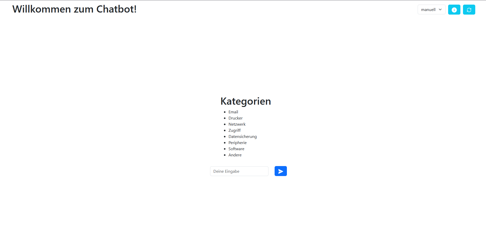

# Chatbot

Projektarbeit für die Berufsschule BS14 in Hamburg. Dieser Chatbot wird im Rahmen von Lernfeld 06 - "Serviceanfragen bearbeiten" von Gruppe 10 aus der 3i erstellt.

### Vorschau



### Videos

- [Setup React-JS with Vite](https://www.youtube.com/watch?v=QYXPMcSKSMM)
- [Setup a Spring Boot Project using Gradle](https://www.youtube.com/watch?v=dXYKX8v84k0)

### Pages

- [Creating a Spring Boot Project](https://start.spring.io/)

### Tools/Programms

- [Intellij Community Edition](https://www.jetbrains.com/idea/download/)
- [WebStorm](https://www.jetbrains.com/de-de/webstorm/download/#section=windows)
- [Node.js mindestens v20.17.0](https://nodejs.org/en/)
- [JDK 21 oder neuer](https://www.oracle.com/java/technologies/javase/jdk21-archive-downloads.html)
- [Ollama Download](https://ollama.com/download)

### Ollama lokal installieren

1. [Ollama](https://ollama.com/download) herunterladen und installieren

2. LLM installieren/starten

```
ollama run llama3.2
```

3. Prüfen ob das Modell installiert ist

```
ollama list
```
